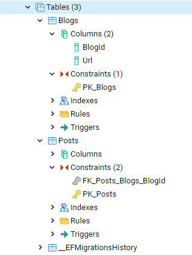

1) Создадим пустой .net core console проект. Добавим поддержку docker-compose, В docker-compose файл добавим БД и pgAdmin

```yml

  postgres:
    image: postgres:11.2-alpine
    shm_size: 256M
    ports:
      - 5432:5432
    volumes:
      - pg_auth_data:/var/lib/postgresql/data
    environment:
      POSTGRES_DB: postgres
      POSTGRES_USER: postgres
      POSTGRES_PASSWORD: postgres

  pgadmin:
    image: dpage/pgadmin4
    environment:
      PGADMIN_DEFAULT_EMAIL: ${PGADMIN_DEFAULT_EMAIL:-pgadmin4@pgadmin.org}
      PGADMIN_DEFAULT_PASSWORD: ${PGADMIN_DEFAULT_PASSWORD:-admin}
    volumes:
       - pgadmin:/root/.pgadmin
    ports:
      - "${PGADMIN_PORT:-5050}:80"

volumes:
  pg_auth_data:
  pgadmin:
```


2) Установка nuget пакетов

```bash
dotnet add package Microsoft.EntityFrameworkCore.Design
dotnet add package Npgsql.EntityFrameworkCore.PostgreSQL
```

3) Добавим контекст

```c#
 public class BloggingContext : DbContext
    {
        public DbSet<Blog> Blogs { get; set; }

        public DbSet<Post> Posts { get; set; }

        protected override void OnConfiguring(DbContextOptionsBuilder optionsBuilder)
            => optionsBuilder.UseNpgsql("Host=postgres;Database=testdb;Username=postgres;Password=postges");
    }

    public class Blog
    {
        public int BlogId { get; set; }
        public string Url { get; set; }

        public List<Post> Posts { get; set; }
    }

    public class Post
    {
        public int PostId { get; set; }
        public string Title { get; set; }
        public string Content { get; set; }

        public int BlogId { get; set; }
        public Blog Blog { get; set; }
    }
```

4) Добавим миграции

Убедимся что контекст виден для EF

```powershell
dotnet ef dbcontext list

PS C:\Users\radiofisik\Desktop\EFTest\EFTest> dotnet ef dbcontext list
EFTest.BloggingContext
```

Добавим миграцию

```powershell
dotnet ef migrations add InitialMigration -c BloggingContext -o Migrations/
```

Убедимся что добавилось корректно

```powershell
dotnet ef migrations list --context EFTest.BloggingContext

PS C:\Users\radiofisik\Desktop\EFTest\EFTest> dotnet ef migrations list --context EFTest.BloggingContext
20190509224711_InitialMigration
```

Применим миграции

```powershell
dotnet ef database update --context EFTest.BloggingContext

PS C:\Users\radiofisik\Desktop\EFTest\EFTest> dotnet ef database update --context EFTest.BloggingContext
Applying migration '20190509224711_InitialMigration'.
Done.
```

> В большинстве случаем контекст в проекте один и команды можно упростить

Как видно в контексте не было упоминаний о том как связаны сущности Blog и Post, хотя обычно это указывается через атрибуты или FluentApi. Тем не менее EF core все понял и создал таблички со связью один ко многим.



Добавим данные

```c#
 private static void AddData()
        {
            var blog = new Blog()
            {
                Url = "https://radiofisik.ru/", Posts = new List<Post>()
                {
                    new Post() {Title = "About this blog", Content = "Github pages is great"},
                    new Post() {Title = "EF", Content = "ef content"}S
                }
            };

            var context = new BloggingContext();

            context.Blogs.Add(blog);
            context.SaveChanges();
        }
```

Получить блоги с постами можно

```c#
 var blogs = context.Blogs.Include(_=>_.Posts).ToList();
```

Альтернативно можно получить связанные сущности когда они будут нужны через явную загрузку

```c#
    var firstBlog = context.Blogs.First();
    context.Entry(firstBlog).Collection(_=>_.Posts).Load();
    var posts = firstBlog.Posts;
```

## Change Tracking

Есть несколько распространенных настроек для оптимизации EF Core, особенно полезных в случае если предпологается что запросы будут только на чтение. По умолчанию EF Core наблюдает за изменениями в запрошенных сущностях, и для записи изменений в БД достаточно выполнить SaveChanges.

```c#
 [Fact]
        public void TrackTest()
        {
            var context = new BloggingContext();
            var firstBlog = context.Blogs.First();

            Assert.Equal(EntityState.Unchanged,context.Entry(firstBlog).State);

            firstBlog.Url = "changedUrl";

            Assert.Equal(EntityState.Modified, context.Entry(firstBlog).State);

        }
```


 Данное поведение можно изменить так настройка ` context.ChangeTracker.AutoDetectChangesEnabled = false;` позволяет отключить автодетект изменений, при попытке изменений состояние остается Unchanged. Чтобы сохранить измененя надо явно вызывать Update и потом SaveChanges

```c#
[Fact]
        public void OffAutoDetectChangesEnabledTest()
        {
            var context = new BloggingContext();
            context.ChangeTracker.AutoDetectChangesEnabled = false;

            var firstBlog = context.Blogs.First();

            Assert.Equal(EntityState.Unchanged, context.Entry(firstBlog).State);

            firstBlog.Url = "changedUrl";

            Assert.Equal(EntityState.Unchanged, context.Entry(firstBlog).State);

            //will not change anything so Don't do it that way
            context.SaveChanges();

            Assert.Equal(EntityState.Unchanged, context.Entry(firstBlog).State);

            context.Blogs.Update(firstBlog);

            Assert.Equal(EntityState.Modified, context.Entry(firstBlog).State);
            
            //will save changes
            context.SaveChanges();
        }
```

Следующая настройка оптимизации   `context.ChangeTracker.QueryTrackingBehavior = QueryTrackingBehavior.NoTracking;` при ее применении после запроса получаем сущность со статусом Detached что значит что EF вообще не в курсе о ее существовании, как будто мы создали ее через new. 

```c#
[Fact]
        public void OffTrackTest()
        {
            var context = new BloggingContext();
            context.ChangeTracker.QueryTrackingBehavior = QueryTrackingBehavior.NoTracking;

            var firstBlog = context.Blogs.First();

            Assert.Equal(EntityState.Detached, context.Entry(firstBlog).State);

            firstBlog.Url = "changedUrl";

            context.Blogs.Update(firstBlog);

            Assert.Equal(EntityState.Modified, context.Entry(firstBlog).State);

            //will save changes
            context.SaveChanges();
        }
```

> Получившийся репозиторий <https://github.com/Radiofisik/EFTest>