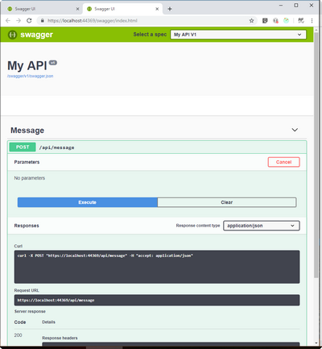
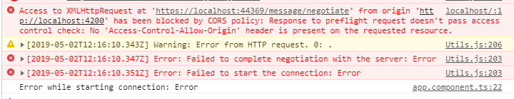
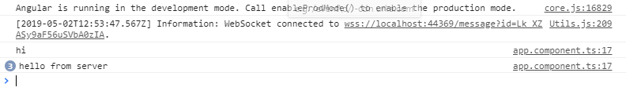

Создадим новый проект Visual Studio через команду `dotnet new` набрав ее без параметров получим список возможных шаблонов. Будем использовать самый простой.

```
dotnet new web
```

## SignalR

Установим nuget пакеты

```
dotnet add package Microsoft.AspNetCore.SignalR
```

В Startup.cs зарегистрируем сервис

```c#
  public void ConfigureServices(IServiceCollection services)
        {
            services.AddSignalR();
        }
```

Создадим класс хаба

```c#
    public class MessageHub: Hub
    {
        public Task Send(string message)
        {
            return Clients.All.SendAsync("Send", message);
        }
    }
```

Зарегистрируем SignalR middleware

```c#
 public void Configure(IApplicationBuilder app, IHostingEnvironment env)
        {
            app.UseSignalR(routes => { routes.MapHub<MessageHub>("/message"); });
        }
```

## MVC

Для целей тестирования добавим контроллер с методом который будет принимать сообщения и слать через SignalR. Для этого зарегистрируем mvc и добавим класс контроллера

```c#
services.AddMvc(); // в ConfigureServices

app.UseMvc(); // в Configure

// контроллер
 [Route("api/message")]
    public class MessageController: Controller
    {
     	[HttpPost]
        public IActionResult Post()
        {
            return Ok();
        }
    }

```

изменим контроллер чтобы он мог отправлять сообщения клиенту

```c#
[Route("api/message")]
    public class MessageController: Controller
    {
        private readonly IHubContext<MessageHub> _hubContext;

        public MessageController(IHubContext<MessageHub> hubContext)
        {
            _hubContext = hubContext;
        }

        [HttpPost]
        public IActionResult Post()
        {
            _hubContext.Clients.All.SendCoreAsync("send", new[] {"hello from server"});
            return Ok();
        }
    }
```


## Swashbuckle

Для удобства запуска метода контроллера добавим swagger через Swashbuckle 

```
dotnet add package Swashbuckle.AspNetCore
```

```c#
 services.AddSwaggerGen(c =>
    {
        c.SwaggerDoc("v1", new Info { Title = "My API", Version = "v1" });
    });
```

```
 // Enable middleware to serve generated Swagger as a JSON endpoint.
    app.UseSwagger();

    // Enable middleware to serve swagger-ui (HTML, JS, CSS, etc.), 
    // specifying the Swagger JSON endpoint.
    app.UseSwaggerUI(c =>
    {
        c.SwaggerEndpoint("/swagger/v1/swagger.json", "My API V1");
    });
```

После чего будут доступны ` http://localhost:<port>/swagger` <https://localhost:44369/swagger/index.html> в конкретном случае и `http://localhost:<port>/swagger/v1/swagger.json`. Подробней про swashbuckle <https://docs.microsoft.com/ru-ru/aspnet/core/tutorials/getting-started-with-swashbuckle?view=aspnetcore-2.2&tabs=netcore-cli>



## Angular

Создадим проект с помощью Angular CLI

```
ng new signalrclient
cd .\signalrclient\
npm install
npm install @aspnet/signalr --save
```

подредактируем app.component.ts чтобы логировать в консоль получаемые сообщения

```typescript
import { Component, OnInit } from '@angular/core';
import * as signalR from '@aspnet/signalr';

@Component({
  selector: 'app-root',
  templateUrl: './app.component.html',
  styleUrls: ['./app.component.scss']
})
export class AppComponent implements OnInit {
  title = 'signalrclient';
  ngOnInit(): void {
    const connection = new signalR.HubConnectionBuilder()
      .withUrl('https://localhost:44369/message')
      .build();

    connection.on('send', data => {
      console.log(data);
    });

    connection.start()
      .then(() => connection.invoke('send', 'hi'))
      .catch(err => console.log('Error while starting connection: ' + err));
  }
}
```
Запустим проект через `ng serve` После запуска откроем <http://localhost:4200/>  в консоле увидим ошибку типичную для CORS. Возникает она потому что по умолчанию кроссдоменный запрос запрещен.



## CORS

```c#
  services.AddCors(options =>
    {
        options.AddPolicy("CorsPolicy",
            builder => builder.WithOrigins("http://localhost:4200")
            .AllowAnyMethod()
            .AllowAnyHeader()
            .AllowCredentials());
    });
```

добавим midleware которое добавить заголовки cors

```c#
 app.UseCors("CorsPolhttps://www.youtube.com/watch?v=R3UJjSAH6bMicy");
```



> Получившийся проект можно загрузить по ссылке https://github.com/Radiofisik/SignalRAngular.git

При написании использованы материалы:
- <https://www.youtube.com/watch?v=R3UJjSAH6bM>
- <https://code-maze.com/netcore-signalr-angular/>
- <https://habr.com/ru/post/338490/>

  