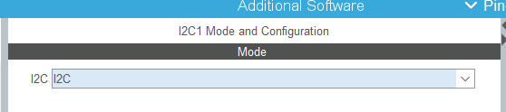
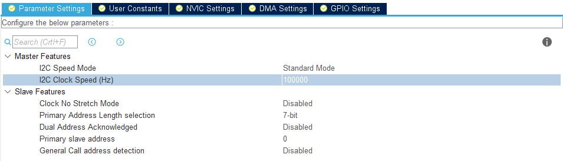
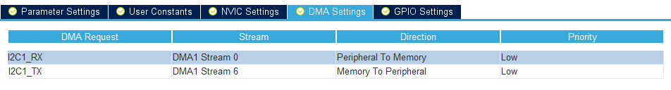
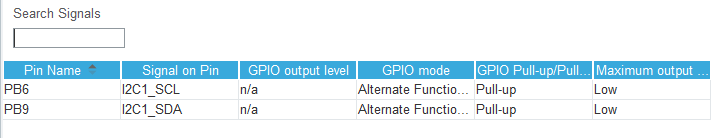
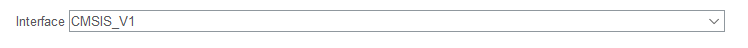
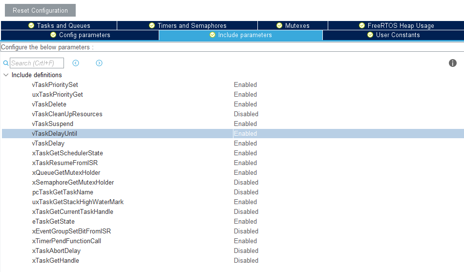
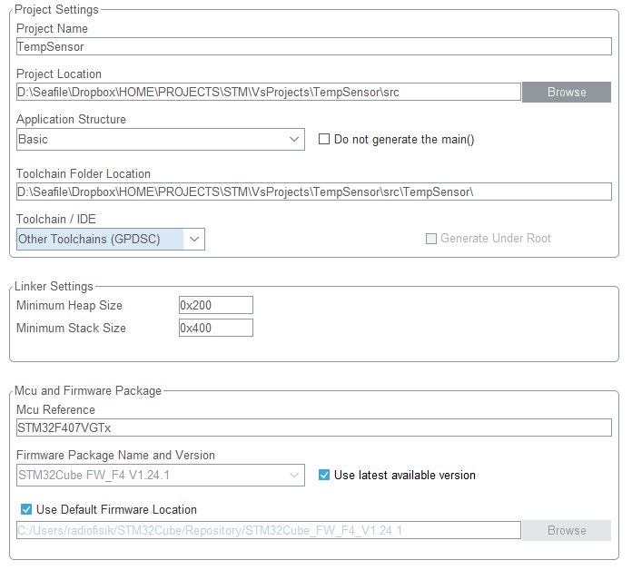
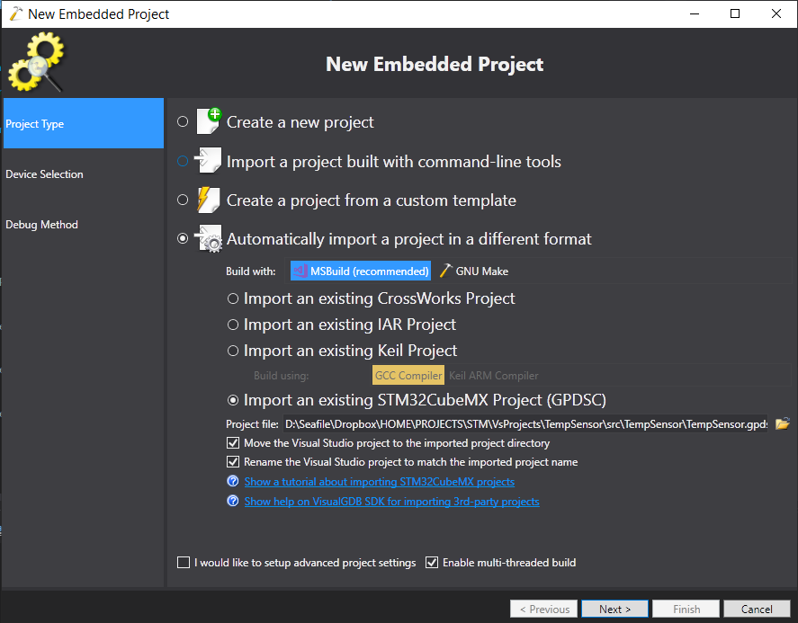
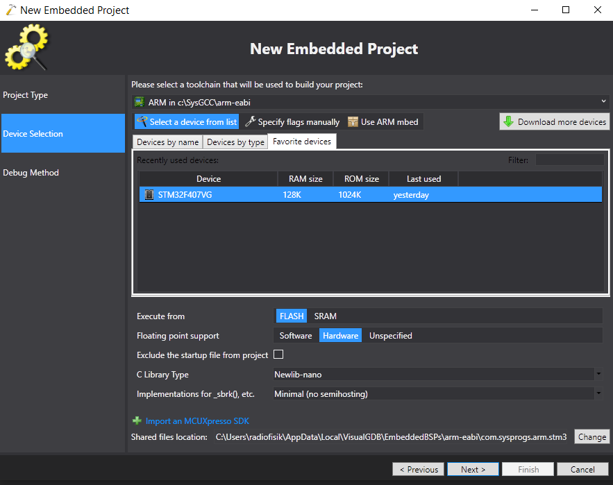
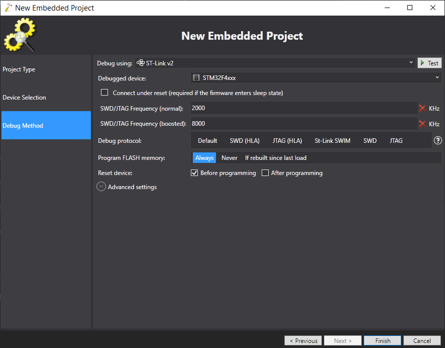

Для начала работы необходимо:

- установить Visual Studio 2017 c поддержкой С++ ( необходим VC++ 2017 toolset см https://visualgdb.com/support/getvcpp/).
- установить VisualGDB (https://visualgdb.com/)
- установить СubeMx (https://www.st.com/en/development-tools/stm32cubemx.html)

Создадим проект в CubeMx на основании модели контроллера STM32F407VG. В данном случае и платы STM32F4DISCOVERY.

Для подключения дисплея будем использовать I2C1. Включим его 



В экране используется микросхема PCF8574  которая поддерживает только 100kGz режим



Настроим DMA



В настойках GPIO видно к каким портам цеплять экран



Включим прерывания



Для подключения экрана будем использовать библиотеку http://blog.bulki.me/STM32-LCD-HD44780-I2C/ https://github.com/firebull/STM32-LCD-HD44780-I2C которая использует функцию vTaskDelayUntil() из FreeRTOS. Включим ее.



Настраиваем выгрузку



> при использовании некоторых функций рекомендуется увеличить Mininum Heap Size и Minimum Stack Size раза в два.

и жмем generate. Далее запускаем Visual Studio 2017. создаем проект в той же папке


Импортируем проект



Выбираем контроллер



выбираем отладчик, предварительно подключив его



Добавим в папки и подключим в проект файлы библиотеки для LCD.

изменим код задачи по умолчанию

```c++
void StartDefaultTask(void const * argument)
{
   /* USER CODE BEGIN StartDefaultTask */
	lcdInit(&hi2c1, (uint8_t)0x27, (uint8_t)4, (uint8_t)20);
    
	// Print text and home position 0,0
	lcdPrintStr((uint8_t*)"Hello,", 6);
    
	// Set cursor at zero position of line 3
	lcdSetCursorPosition(0, 2);

	// Print text at cursor position
	lcdPrintStr((uint8_t*)"World!", 6);

	for (;;) {
		vTaskDelay(1000);
	}
}
```

После запуска получим долгожданный hello world на экране

##  DHT22

определимся с портом к которым будем подключать DHT22 пусть это будет PE6. в cube настроим этот порт как input. Добавим в проект файлы библиотеки [библиотеки](https://github.com/MYaqoobEmbedded/STM32-Tutorials/tree/master/Tutorial 25 - DHT22 Temperature Sensor).  Как выяснилось в библиотеки есть баги, в версии проекта они поправлены. После подключения библиотеки для считывания показаний достаточно испоьзовать код

```c
float temp, humid;
DHT22_Init(GPIOE, GPIO_PIN_6);
DHT22_GetTemp_Humidity(&tmp, &humid);
```

## Free RTOS

Технологии достигли тех высот когда даже на микроконтроллере может быть запущена операционная система. Одной из функций  ОС является распределение времени процессора между задачами - по сути реализация многозадачности. Программировать так намного удобнее. Для примера дажа в простейшем устройстве - термометре можно создать две задачи. Одна будет опрашивать датчик, вторая выводить информацию на дисплей. Для передачи данных между задачами можно использовать глобальные переменные - через слово `extern` или передавать как параметр задачи.

Объявим переменые

```c
osThreadId displayTaskHandle;
osThreadId sensorTaskHandle;
float Temp = 10;
float Humidity = 10;

DisplayStruct ds;
SensorStruct ss;
```

Запустим задачи

```c
ss.humidity = &Humidity;
ss.temperature = &Temp;
osThreadDef(sensorTask, StartSensorTask, osPriorityNormal, 0, 256);
sensorTaskHandle = osThreadCreate(osThread(sensorTask), (void*) &ss);


ds.i2c = &hi2c1;
ds.humidity = &Humidity;
ds.temperature = &Temp;
osThreadDef(displayTask, StartDisplayTask, osPriorityNormal, 0, 256);
displayTaskHandle = osThreadCreate(osThread(displayTask), (void*) &ds);
```

Реализуем модуль дисплея. Для начала в заголовочном файле объявим функцию задачи и структуру для передачи данных

```c
typedef struct
{
	I2C_HandleTypeDef * i2c;
	float * temperature;
	float * humidity;
}DisplayStruct;

static void DisplayInit(I2C_HandleTypeDef * i2c);

static void PrintHumidity(float humidity);

static void PrintTemp(float temp);

void StartDisplayTask(void const * argument);
```

Реализуем эти функции, учитывая тот факт что используемая библиотека без дополнительных опций линковки не поддерживает sprintf для float

```c
#include "Display.h"

static void DisplayInit(I2C_HandleTypeDef * i2c)
{
	lcdInit(i2c, (uint8_t)0x27, (uint8_t)4, (uint8_t)20);
    
	// Print text and home position 0,0
	char * initString = "Temperature sensor";
	
	lcdPrintStr((uint8_t*)initString, strlen(initString));
}

static void ToString(char* str, float num)
{
	char *tmpSign = (num < 0) ? "-" : "";
	float tmpVal = (num < 0) ? -num : num;
	int tmpInt1 = tmpVal;                  
	float tmpFrac = tmpVal - tmpInt1;      
	int tmpInt2 = trunc(tmpFrac * 10); 
	sprintf(str, "%s%d.%01d", tmpSign, tmpInt1, tmpInt2);
}

static void PrintTemp(float temp)
{
	char numstr[5];
	char str[20];
	ToString(numstr, temp);
	sprintf(str, "Temperature = %s", numstr);
	
	lcdSetCursorPosition(0, 1);	
	lcdPrintStr((uint8_t *)str, strlen(str));
}

static void PrintHumidity(float humidity)
{
	char numstr[5];
	char str[20];
	ToString(numstr, humidity);
	sprintf(str, "Humidity = %s", numstr);
				
	lcdSetCursorPosition(0, 2);
	lcdPrintStr((uint8_t *)str, strlen(str));
}

void StartDisplayTask(void const * argument)
{
	DisplayStruct* ds = (DisplayStruct *) argument;

	DisplayInit(ds->i2c);
	
	for (;;)
	{
		PrintTemp(*ds->temperature);
		PrintHumidity(*ds->humidity);
		vTaskDelay(1000);
	}
}
```

Аналогично с модулем для датчика

```c
typedef struct
{
	float * temperature;
	float * humidity;
}SensorStruct;

void StartSensorTask(void const * argument);
```

```c
void StartSensorTask(void const * argument)
{
	SensorStruct * ss = (SensorStruct *) argument;
	
	DHT22_Init(GPIOE, GPIO_PIN_6);
	
	for (;;) {
		
		if (DHT22_GetTemp_Humidity(ss->temperature, ss->humidity) == 0)
		{
			ss->temperature = 0;
		}
		vTaskDelay(1000);
	}
}
```

> Репозиторий проекта https://github.com/Radiofisik/TempSensor